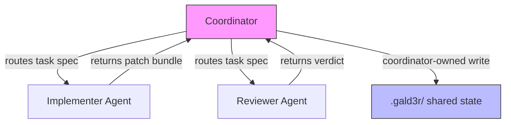

Pipeline orchestrator — implement then auto-review: $ARGUMENTS

## Mode: PIPELINE (Implement → Auto-Review)

`g-go` is a **two-phase pipeline**. Phase 1 implements tasks; Phase 2 automatically spawns an
independent reviewer agent on the completed work. You get adversarial QA without manually
alternating between sessions.

> **Independence guarantee**: The Phase 2 reviewer is a fresh Task subagent. It receives only
> the task IDs and the `g-go-review` protocol — it has **no access** to Phase 1's conversation
> history, reasoning, or implementation decisions. It reads the artifacts on disk cold.

---

## 🚦 Coordinator: Routing-Only Mandate

> **The coordinator never implements. It only routes, observes, and reconciles.**
>
> If the coordinator finds itself about to write production code or do file edits for a task,
> it **MUST STOP** and delegate to `g-go-code` instead. This is the **pure routing orchestrator**
> pattern — the coordinator is traffic control, not implementation. (OpenSwarm F-002, Anthropic
> multi-agent coordination 2026-05-07.)

**Routing decision record** — for each subtask the coordinator logs to the task's Status History:

```
ROUTE: {task_id} → {specialist} ({mode}) — {reason}
```

**Mode choices:**
- **`SendMessage`** (parallel) — independent subtask, no cross-bucket deps; fire-and-forget. Maps to `--swarm` parallel buckets.
- **`Handoff`** (sequential) — full-context transfer required from a prior result; wait for upstream output. Maps to the sequential `g-go-code → g-go-review` pipeline.

**Coordinator-owned writes** — all shared `.gald3r/` write operations (TASKS.md, task files, BUGS.md,
CHANGELOG.md, generated prompts, parity output) are **coordinator-owned steps** performed after
specialist results are collected. They are never delegated to bucket agents or specialist executors.

### Routing Flowchart



---

### ⛔ NO-PROMPT RULE — READ AND ENFORCE BEFORE DOING ANYTHING ELSE

**The coordinator MUST NEVER ask the user to confirm a plan, select a scope, choose between options, or approve a proposal.** This command is designed for fire-and-forget operation across multi-window workflows and scheduled automation. The user has already expressed intent by typing the command; they are not watching this session.

The **only** valid reasons to stop mid-run are the explicitly documented **hard-gate failures** listed below (PCAC conflict exit-code `2`, dirty orchestration root outside this run's staging allowlist, manifest / `workspace_repos` resolution error on multi-repo work). Any ambiguity that is NOT one of those hard gates is **resolved silently by the auto-plan rules below** and the run proceeds without comment.

Asking "Go?" or "Confirm?" or "Which tasks?" or "Conservative or expanded?" is a **violation of this rule**. If you find yourself composing a confirmation question, apply the auto-plan instead and start working.

#### Auto-Plan Algorithm (no explicit task IDs in `$ARGUMENTS`)

When `$ARGUMENTS` is empty or contains no task/bug IDs, the coordinator selects the work queue **immediately and silently** using these ordered rules:

1. **Scope filter** — branches on the `--workspace` flag (T532):
   - **Bare `/g-go` (default, no `--workspace`)** — include only items that are **gald3r_dev-scoped**: the task's `workspace_repos` field is absent, empty, or contains only the controller repo's own manifest ID (`gald3r_dev`). Items whose `workspace_repos` lists other member repos are **deferred** (logged as `Deferred — member-repo scope` in the session summary; no prompt to the user). Bare `/g-go` MUST NEVER scan all manifest workspace repositories — that is the explicit `--workspace` opt-in below.
   - **`/g-go --workspace`** — include items routed to any manifest-declared workspace repository whose `repository.local_path` exists, whose `lifecycle_status` permits work, and whose `allowed_write_policy` is compatible with the task's `workspace_touch_policy`. Items routing to repos that are missing/planned/unavailable, write-disallowed, or unauthorized are **deferred** with explicit per-repo reasons in the summary. The orchestration controller and every selected member repo each get their own per-root clean check, worktree context, and blocker reporting; no per-repo blocker silently affects unrelated repos.
2. **Phase 1 queue** — all `[📋]` / `[ ]` / stale-`[📝]` items that pass the scope filter, ordered Critical → High → Medium → Low. Apply the auto-downgrade rule: if exactly one implementation item passes the filter, downgrade to single-agent `g-go-code` and continue — do not stop.
3. **Phase 2 queue** — all `[🔍]` items that pass the scope filter and are reachable from the Phase 1 checkpoint.
4. **Zero runnable items** — output `[PIPELINE] No runnable items after scope filter. Deferred: {list with reasons}. Nothing to commit.` and exit cleanly. **Do not ask what to do.**

When `$ARGUMENTS` provides explicit task/bug IDs, use those IDs exactly — skip scope filtering. The user's explicit selection is the plan. The `--workspace` flag still affects per-repo clean-check and authorization behavior even with explicit IDs: every repo touched by the explicit task list is gated per-root.

---

## Prompt Template Variables (T1175 — Sandcastle promptArgs pattern)

When the `g-go` coordinator dispatches a task to an implementer subagent (`g-go-code`) or to a reviewer subagent (`g-go-review`), the dispatch prompt is **templated**: the coordinator substitutes a fixed set of template variables at runtime before the subagent receives the prompt. This eliminates the "hand-edit the prompt per task" anti-pattern and gives a stable, audit-able dispatch surface.

Supported template variables (resolved at coordinator dispatch time, never inside the bucket agent):

| Variable | Resolved from | Example resolution |
|----------|---------------|-------------------|
| `{{TASK_ID}}` | Numeric ID of the queued task (no `T` prefix) | `1175` |
| `{{TASK_TITLE}}` | `title:` field of the task YAML frontmatter | `Sandcastle g-go pipeline patterns` |
| `{{SKILL_PATH}}` | Absolute path to the active gald3r skill folder for the dispatch role | `.claude/skills/g-skl-tasks` |
| `{{BRANCH_NAME}}` | Worktree branch from `gald3r_worktree.ps1 -Action Create -Json` output | `gald3r/1175/code/gald3r_dev/autopilot-iter9` |
| `{{TASK_FILE}}` | Path to the active task file under `.gald3r/tasks/**` | `.gald3r/tasks/open/task1175_sandcastle_g_go_pipeline_patterns.md` |
| `{{WORKTREE_PATH}}` | Absolute worktree path from the helper JSON | `G:/gald3r_ecosystem/.gald3r-worktrees/gald3r_dev/1175-code-autopilot-iter9` |
| `{{MODE}}` | Resolved model tier (`fast` | `standard` | task `preferred_model:` override) | `standard` |
| `{{COORDINATOR_AGENT}}` | Slug of the coordinator agent for audit trail | `autopilot-iter9` |

**Resolution rules:**

1. All `{{VAR}}` tokens are resolved by simple string substitution **before** the prompt is sent to the subagent. The subagent receives a fully-materialized prompt — it never sees an unresolved `{{...}}` token.
2. If a referenced variable cannot be resolved (e.g. `{{TASK_TITLE}}` for a task with no `title:` field), the coordinator logs the failure as `PROMPTARG_FAIL: {{VAR}} unresolved for T{id}` and **defers** the item rather than dispatching with a malformed prompt.
3. Custom dispatch prompts may extend the template set, but the eight variables above are **guaranteed** present in every dispatch and must never be re-purposed for other meanings.
4. Template variable substitution is a coordinator-only operation — bucket agents and reviewer subagents must NOT receive raw template strings to render themselves.

**Why this matters**: a structured templating surface lets the coordinator log exactly which payload each subagent received (audit), lets dispatch prompts evolve without rewriting every bucket call-site, and lets future provider adapters (see "Provider-Agnostic Adapter Pattern" below) translate `{{VAR}}` into provider-specific argument shapes (OpenAI tool args, Anthropic content blocks, etc.) at a single chokepoint.

## Swarm Lifecycle Hooks (T1175 — Sandcastle lifecycle pattern)

`g-go --swarm` (and `g-go-code --swarm` / `g-go-review --swarm`) supports **optional** PowerShell lifecycle hook scripts that fire at bucket transition points. Hooks are advisory observation/notification surfaces — they MUST NOT mutate task state, write to shared `.gald3r/` ledgers, or affect coordinator routing decisions. They are intended for logging, metrics, external notifications (Slack/Rally/PagerDuty), and developer-machine status displays.

### Hook contract

The coordinator looks for the following optional PowerShell scripts in the active IDE hooks folder (first match wins across `.claude/hooks/`, `.cursor/hooks/`, `.agent/hooks/`, `.codex/hooks/`, `.copilot/hooks/`, `.opencode/hooks/`):

| Hook script | Fires when | Coordinator-passed arguments |
|-------------|-----------|-----------------------------|
| `g-hk-on-bucket-start.ps1` | Immediately after a bucket worktree is created and just before the bucket agent is spawned | `-BucketId <int> -TaskIds <int[]> -WorktreePath <string> -Branch <string> -Mode <string>` |
| `g-hk-on-bucket-complete.ps1` | After a bucket agent returns its handoff payload (PASS, partial, or with Blockers) and before coordinator reconciliation begins on that bucket | `-BucketId <int> -TaskIds <int[]> -PassCount <int> -BlockedCount <int> -DurationSeconds <int> -Verdict <string>` |
| `g-hk-on-bucket-error.ps1` | When a bucket agent fails to return a parseable payload, times out, or returns an error verdict | `-BucketId <int> -TaskIds <int[]> -ErrorType <string> -ErrorMessage <string>` |

### Coordinator invocation pattern

```powershell
# Pseudo-code the coordinator follows for each hook
$hook = @(
  ".cursor\hooks\g-hk-on-bucket-start.ps1",
  ".claude\hooks\g-hk-on-bucket-start.ps1",
  ".agent\hooks\g-hk-on-bucket-start.ps1",
  ".codex\hooks\g-hk-on-bucket-start.ps1",
  ".copilot\hooks\g-hk-on-bucket-start.ps1",
  ".opencode\hooks\g-hk-on-bucket-start.ps1"
) | Where-Object { Test-Path $_ } | Select-Object -First 1
if ($hook) {
  powershell -NoProfile -ExecutionPolicy Bypass -File $hook `
    -BucketId 1 -TaskIds @(7,9) -WorktreePath "..." -Branch "..." -Mode "fast"
}
```

### Hook rules

- **Optional**: missing hook scripts are NOT an error. The coordinator continues silently when no hook is present.
- **Read-only side effects**: hooks must NOT touch `.gald3r/TASKS.md`, `.gald3r/BUGS.md`, task/bug files, `CHANGELOG.md`, parity output, or git state. They may write to `.gald3r/logs/`, external systems, or stdout for the coordinator session log.
- **Non-blocking**: hooks run with a 30-second timeout (override via `GALD3R_HOOK_TIMEOUT_SECONDS`). If a hook exceeds the timeout or exits non-zero, the coordinator logs `HOOK_FAIL: <script> exit=<n>` to the session summary and continues — a failed hook never blocks bucket progression.
- **Idempotent**: hooks may be invoked more than once per bucket if the coordinator retries (e.g. on transient parse failures). Hook scripts must tolerate replay without producing duplicate side effects on external systems.
- **Documented contract**: the hook script's parameter block MUST match the argument table above; coordinators will pass arguments by name (`-BucketId`, `-TaskIds`, etc.) and ignore additional declared parameters.

### Contract definition only — no example scripts shipped

This command defines the contract. Concrete hook scripts (e.g. "post bucket-complete to Slack", "write a metric to Datadog", "ping Rally with `Rally-Comment`") are NOT shipped in the gald3r template — operators write them per environment. Place hook scripts in the appropriate `<ide>/hooks/` folder using the names above; the coordinator discovers them automatically on the next swarm run.

## Provider-Agnostic Adapter Pattern (T1175 — Sandcastle adapter pattern)

`g-go` does not own model selection — by design. The gald3r framework is a **prompt orchestrator**: it routes work, partitions buckets, gates safety, and writes shared state, but the actual LLM call is delegated to the host IDE harness (Claude Code, Cursor, Codex, Gemini, OpenCode, Copilot). The provider-agnostic abstraction in gald3r is the `--mode` flag combined with the per-task `preferred_model:` field — see "Model-Tier Selection" below.

**The adapter surface, in concrete terms:**

| Layer | Owner | What it does |
|-------|-------|--------------|
| Tier selection (`fast` / `standard` / `cheap`) | `g-go` / `g-go-code` flag | Provider-agnostic intent: "this task wants a cheap model" or "this task needs a reasoning model". Recorded in Status History as `mode=<tier>`. |
| Per-task override (`preferred_model:`) | Task YAML | Provider-agnostic intent: "this specific task needs Opus" or "this specific task is fine on Haiku", overrides session mode. |
| Tier → concrete model resolution | Host IDE harness | The IDE maps `fast` → `claude-haiku-4-5` (Claude Code), `fast` → `gpt-4o-mini` or `haiku` (Cursor), etc. See the Mode Mapping table in "Model-Tier Selection" below for current resolutions per IDE. |
| API call | Host IDE harness | gald3r never opens an HTTPS connection to a model provider. The IDE owns auth, rate limits, retries, and streaming. |

**Why this matters for adoption**: a future IDE adding gald3r support (e.g. a new local-LLM CLI) does not require any gald3r changes. The new IDE adds its own `--mode` → `model-name` mapping; gald3r continues to emit `mode=<tier>` and `preferred_model:` annotations unchanged. The Sandcastle adapter pattern is satisfied because the abstraction lives at the tier-of-intent level, not the model-name level.

**Limit**: this is a tier-of-intent abstraction, not a runtime model swap. gald3r cannot fail over from one provider to another mid-task if the IDE-configured model is rate-limited. That is properly an IDE-layer concern. Operators who need cross-provider failover should configure it in the IDE (e.g. Cursor's model-fallback settings) — gald3r will inherit it.

## Iteration and Timeout Limits (T1175 — Sandcastle pattern)

`g-go` accepts dual stop-conditions in `$ARGUMENTS` that bound the **pipeline** run (both phases combined). **Whichever limit hits first stops new work cleanly**; in-flight items finish, status writes batch, the review-result commit lands, and the pipeline summary is written.

| Flag | Default | Override env var | Behavior |
|------|---------|------------------|----------|
| `--max-iterations N` | `5` | `GALD3R_MAX_ITERATIONS` | Maximum number of items the pipeline will process this session (Phase 1 implementation count). Once N items reach `[🔍]` or Blocked, Phase 1 stops claiming and Phase 2 reviews only those N items. |
| `--timeout-minutes M` | `30` | `GALD3R_TIMEOUT_MINUTES` | Wall-clock budget from pipeline start. When elapsed minutes ≥ M and the current item finishes, Phase 1 stops claiming. If Phase 2 has not yet spawned when the timer expires, it still spawns once on the already-checkpointed items (the user has earned a review pass for the work that completed). |

**Enforcement rules:**

- Limits are checked between items, never preemptively. An in-flight item is never interrupted mid-edit.
- `--max-iterations` counts Phase 1 attempts (PASS + BLOCKED items). It does not separately bound Phase 2 — once Phase 1 stops, Phase 2 reviews whatever made it to `[🔍]`.
- `--timeout-minutes` is wall-clock from pipeline start (NOT from each phase start). A pipeline at minute 28 will not start a new Phase 1 item even if Phase 1 has been the only active phase.
- In `--swarm` mode, limits apply to the coordinator's scheduling: `--max-iterations` caps total items partitioned across all buckets; `--timeout-minutes` is a coordinator-level wall-clock fence.
- Either limit hitting MUST be logged in the Pipeline Session Summary as `Stop reason: queue exhausted | max-iterations (N of N) | timeout-minutes (M elapsed) | hard-gate blocker`.
- Explicit `$ARGUMENTS` flags override env vars; env vars override defaults.

**Why dual limits**: see the matching section in `g-go-code.md` — iteration alone is brittle for tasks of mixed size; wall-clock alone is brittle when many small items finish cleanly. Together they bound both work and time.

## Model-Tier Selection (`--mode fast|standard|cheap`)

`g-go` accepts an optional `--mode` flag in `$ARGUMENTS` that selects model-tier policy for
the pipeline. The flag composes with `--swarm`, `--workspace`, and any task/bug filter.

### Mode mapping table

| `--mode` | Tier | Claude model | Cursor model | Use when |
|----------|------|--------------|--------------|----------|
| `fast` (alias `cheap`) | haiku-class | `claude-haiku-4-5` | `gpt-4o-mini` / `haiku` | Simple task batches, cost-sensitive runs, bucket agents on parallel-safe work |
| `standard` (default) | sonnet-class | `claude-sonnet-4-6` | `sonnet-4` | Most pipelines, coordinator role, anything requiring real reasoning |
| (no flag) | inherit | session default | session default | Fall through to the IDE-configured default model |

`cheap` is a strict alias for `fast` (same tier, same model mapping).

### Coordinator vs bucket inheritance (AC4)

`g-go` (and `g-go --swarm`) treats `--mode` differently for the coordinator role and bucket
agents:

- **Coordinator** — always defaults to `standard` regardless of the session `--mode` flag.
  Coordinators route work, plan partitions, perform reconciliation, and write shared
  `.gald3r/` state — these operations require Sonnet-class reasoning. The only way to force
  the coordinator onto a lower tier is to pass `--mode fast` AND set the env override
  `GALD3R_ALLOW_FAST_COORDINATOR=1` (intended for experimental/automated regression suites,
  not production pipelines).
- **Bucket agents (Phase 1 implementers)** — inherit the session `--mode` flag. When the
  session is launched as `@g-go --swarm --mode fast`, every bucket implementer runs in
  `fast` mode (haiku-class). When the session is `@g-go --swarm --mode standard` or
  `@g-go --swarm` with no flag, buckets run `standard`.
- **Phase 2 reviewer** — defaults to `standard` for adversarial review. Override only with
  explicit `--mode fast` on the session AND a per-task `preferred_model:` declaring the
  reviewer tier; otherwise the reviewer agent always runs `standard` to protect the
  independence guarantee.
- **Task YAML `preferred_model:` overrides** — when a queued task sets `preferred_model:`
  (`haiku` | `sonnet` | `opus` | `fast` | `standard`) in its frontmatter, that overrides the
  bucket inheritance for that specific task. Use this to keep one complex task on Opus while
  the rest of the swarm runs on Haiku, or vice versa.

### Status History mode logging (AC5)

When Phase 1 claims a task and moves it to `[🔄]` / `in-progress`, the claim's Status History
row MUST include `mode=<tier>` in the `Message` column (see `g-go-code` for the full row
template). The coordinator records its own routing mode and each bucket agent records its
inherited mode independently. This applies to both single-agent `g-go` and swarm
coordination.

---

### PCAC Inbox Gate (Only When PCAC Is Configured)

Before task claiming, implementation, verification, planning, or swarm partitioning, first determine whether this project is a PCAC participant. PCAC is configured only when `.gald3r/linking/link_topology.md` declares at least one parent/child/sibling relationship, or `.gald3r/PROJECT.md` explicitly declares PCAC project linking relationships. A Workspace-Control manifest and local `INBOX.md` alone do not make the project a PCAC group member.

If PCAC is configured, run the re-callable inbox check when the hook exists:

```powershell
$hook = @( ".cursor\hooks\g-hk-pcac-inbox-check.ps1", ".claude\hooks\g-hk-pcac-inbox-check.ps1", ".agent\hooks\g-hk-pcac-inbox-check.ps1", ".codex\hooks\g-hk-pcac-inbox-check.ps1", ".opencode\hooks\g-hk-pcac-inbox-check.ps1" ) | Where-Object { Test-Path $_ } | Select-Object -First 1
if ($hook) { powershell -NoProfile -ExecutionPolicy Bypass -File $hook -ProjectRoot . -BlockOnConflict }
```

Installed templates may call the equivalent hook from the active IDE folder. If the check reports `INBOX CONFLICT GATE` or exits with code `2`, stop immediately and run `@g-pcac-read`; do not claim tasks, create worktrees, spawn reviewers, or continue planning until conflicts are resolved. Non-conflict requests, broadcasts, and syncs are advisory and should be surfaced in the session summary. If PCAC is not configured, skip this gate and report `PCAC: not configured / skipped`.


### Gald3r Housekeeping Commit Gate (T531)

<!-- T531-HOUSEKEEPING-GATE -->
After the PCAC gate is skipped or passes and **before** the Clean Controller Gate hard-blocks the run, run the safety classifier helper at the orchestration root:

```powershell
.\scripts\gald3r_housekeeping_commit.ps1 -Mode preflight -Apply -TaskId <id-when-known> -Json
```

Behavior:

- **`clean`** -> continue.
- **`safe-gald3r-housekeeping`** -> the helper stages **only** allowlisted controller `.gald3r/` paths via explicit `git add -- <paths>` (never `git add .`), re-checks for drift, and creates a focused `chore(gald3r): preflight gald3r housekeeping` commit. The run continues automatically.
- **`unsafe-gald3r` / `mixed-dirty` / `conflict` / `drift-detected` / unknown `.gald3r` paths / member-repo `config-fault`** -> the helper exits non-zero, the existing Clean Controller Gate hard-block applies, and the run STOPs with the exact unsafe paths listed.

The helper allowlist covers the safe controller `.gald3r/` coordination surfaces (TASKS.md, BUGS.md, FEATURES.md, PRDS.md, SUBSYSTEMS.md, IDEA_BOARD.md, learned-facts.md, tasks/, bugs/, features/, prds/, subsystems/, reports/, logs/pcac_auto_actions.log, linking/sent_orders/, linking/INBOX.md). The deny list covers `.identity`, `.user_id`, `.project_id`, `.vault_location`, `vault/`, `config/`, `.gald3r-worktree.json`, secret-named files, and unknown `.gald3r/` paths. Member-repo targets (marker-only `.gald3r/`) are refused -- this gate is **controller-only**.

Re-run the helper in `-Mode post-write -Apply` immediately after coordinator-owned shared `.gald3r` writes (task/bug status writes, review-result writes, sent_orders ledger updates, safe report/log outputs) and before the next major phase so the shared-state dirty window stays short. In `--swarm` flows only the coordinator runs the helper; bucket agents remain handoff producers.
### Clean Controller Gate (before claims, worktrees, reconciliation)

After the PCAC gate is skipped or passes:

1. At the **orchestration git root** (the repo from which you run this command — normally the Workspace-Control owner, e.g. `gald3r_dev`): run `git status --short`. If anything is listed **outside** this run's explicit coordinator staging allowlist for the active task and bug IDs, **STOP** here. Do not claim tasks or bugs, create or reuse T170 worktrees, partition swarms, or write coordinator-owned updates to `.gald3r/TASKS.md`, `.gald3r/BUGS.md`, other shared `.gald3r` coordination files, `CHANGELOG.md`, generated Copilot prompts, or parity output until unrelated changes are committed, stashed, or moved to a prior focused commit. Preserve any bucket handoff artifacts already produced and list the paths that blocked progress.

2. **`gald3r_worktree.ps1 -AllowDirty`**: do not use this switch for `g-go`, `g-go-code`, `g-go-review`, or any `--swarm` variant **except** when every dirty path is owned exclusively by the active task/bug scope and a `## Status History` row documents that override. Otherwise clean the checkout first. The same **per-root** `-AllowDirty` discipline applies to every repository included in the touch set below when multi-repo work is in scope.

3. **Member touch-set (v1 — `workspace_repos`)** — The orchestration root is **always** gated. When the active task or bug declares **`workspace_repos:`** with manifest `repository.id` entries, extend the gate to each **other** resolved member root (blast radius follows declared cross-repo scope). Read `.gald3r/linking/workspace_manifest.yaml` when present; map each listed ID (deduplicated) to `repositories[?].local_path`. For each existing path, run `git -C "<path>" rev-parse --show-toplevel` then `git status --short` at that root. Apply the same **explicit coordinator staging allowlist** per root. Skip IDs whose paths are missing while `lifecycle_status` is a planned/bootstrap gap (report only; do not expand the touch set). If the manifest is missing while `workspace_repos` is non-empty, or an ID is unknown under `repositories:`, **STOP** multi-repo coordinator work until manifest or frontmatter is repaired (controller-only queue items whose `workspace_repos` lists only the owner id may proceed once that id resolves).

4. **Touch-set expansion (v2 — optional signals)** — Union extra repository roots into the same per-root checks (still **not** a blanket scan of every manifest member):
   - **`extended_touch_repos:`** — optional task/bug YAML list of additional manifest `repository.id` values beyond `workspace_repos`.
   - **`touch_repos:` (swarm handoffs)** — In `--swarm` runs, when bucket work edits roots not already covered by `workspace_repos` + `extended_touch_repos:`, bucket summaries and the coordinator reconciliation block MUST list those ids under `touch_repos:` so the union is gated before shared writes.
   - **Subsystem `locations:` absolutes** — When the active item declares **`subsystems:`**, read each `.gald3r/subsystems/{name}.md` frontmatter **`locations:`** (all nested strings). For values matching a host **absolute** path (`^[A-Za-z]:[/\\]` on Windows, or POSIX `/` rooted at `/` elsewhere), if the path exists, resolve `git -C <dir> rev-parse --show-toplevel` (use the file's parent directory when the path is a file). Each distinct root **other than** the orchestration root joins the touch set. Relative paths do not expand the set.

### Pre-Reconciliation Clean Gate (before coordinator shared writes)

Also re-run the **Gald3r Housekeeping Commit Gate** with `-Mode post-write -Apply` against the orchestration root immediately after each coordinator-owned shared `.gald3r` write so safe controller coordination state lands in a focused `chore(gald3r): commit g-go coordination state` commit before the next major phase begins.


Immediately before the coordinator merges bucket results into the primary checkout, updates shared `.gald3r` indexes or task/bug files as coordinator-owned writes, touches `CHANGELOG.md`, or creates checkpoint / review-result commits: **re-run** `git status --short` on the **orchestration root and every other repository root in the computed touch set** (steps 1 + 3 + 4). For `--swarm` runs, if unrelated dirty paths appear in **any** of those roots during parallel bucket work, **fail closed** — do not apply those shared writes; keep patches, artifacts, and evidence; report **per-root** blockers using the same blocker family as checkpoint and review-result commits.

## Session-Start: Load Active Goal (Goal-Locked Loop)

> Fires immediately after safety gates pass, before Phase 1 work begins. If no active goal is set, this section is a no-op.

If `.gald3r/config/ACTIVE_GOAL.md` exists:

1. Read the file. Parse its YAML frontmatter (`description`, `linked_task`, `set_at`, `turn_budget`, `turns_consumed`).
2. Inject into working context as the prefix:
   ```
   CURRENT GOAL: <description> (turn <turns_consumed>/<turn_budget>, task T{id})
   ```
3. Increment `turns_consumed` by 1 and write the updated value back to `ACTIVE_GOAL.md`.
4. If `turns_consumed >= turn_budget`:
   - Surface `🎯 Goal turn budget exhausted — pausing for user direction.`
   - Stop the run cleanly. The user must extend the budget (`@g-goal <description>` to reset) or clear the goal (`@g-goal clear`).

If `--with-goal T{id}` was passed in `$ARGUMENTS`:

1. Treat as if `@g-goal --from-task T{id}` were just run: read `.gald3r/tasks/task{id}_*.md` (active or archive), set `ACTIVE_GOAL.md` from the task title, then proceed.
2. Set `linked_task: T{id}` and the description from the task `title:` field. Default `turn_budget: 50`.

If no `ACTIVE_GOAL.md` exists and no `--with-goal` flag is present, proceed without a goal lock (normal operation).

**Goal-aligned AC gate** (Phase 1 implementation only): after each AC-gate iteration in Phase 1, the implementing agent (or per-bucket implementer) self-checks: "Did this action advance `<description>`?" If not, re-anchor on the goal in the next reasoning step. This is a soft drift-correction — not a hard block.

See `g-goal` command (parity across all 6 IDE platforms) for the full goal-locked loop specification.

---

## Phase 1: Implementation

Phase 1 runs the full `g-go-code` protocol. Every completed item is marked `[🔍]`.
During Phase 1, the implementation-only boundary still applies: run smoke/unit readiness checks only, and do not invoke full adversarial review. Only Phase 2 may spawn the independent reviewer.

### Step 0a — Shell Router (T1144, before any tool call)

Before issuing any shell, hook, or git command in this run, **probe once** and lock the shell route for the session. This complements the always-apply rule `g-rl-00-always` §6 ("Shell Context — OS + Shell Probe") and prevents the bash-vs-PowerShell token-waste loop documented in BUG-031 / T1144.

**Probe (one signal, not a diagnostic loop):**

| Signal | Route |
|---|---|
| `$env:OS` contains `Windows`, or `$IsWindows -eq $true`, or harness reports `Shell: PowerShell` | **PowerShell route** — use a `PowerShell` / `Shell` tool when available |
| `uname -s` returns `Linux` / `Darwin`, `$BASH_VERSION` is set, or harness reports `Shell: Bash` | **bash/zsh route** — use the `Bash` tool |

**Lock and route every subsequent invocation through the chosen interpreter.** Do not mix syntaxes inside a single tool call — the tool, not the snippet, picks the parser. If the harness exposes both `Bash` and `PowerShell` tools on Windows, prefer the PowerShell tool for PowerShell snippets.

Concrete syntax differences to keep in mind (mirrors `g-rl-00-always` §6):

- Arrays: `@(...)` (PS) vs `(...)` / `arr=(a b c)` (bash)
- Statement separators: `;` sequential (PS, both); `&&` short-circuit (bash always, PS 7+)
- Env vars: `$env:VAR` (PS) vs `$VAR` / `${VAR}` (bash)
- Paths: `\` (PS, `/` also accepted on Windows) vs `/` (bash)
- File-exists test: `Test-Path $p` (PS) vs `[ -f "$p" ]` (bash)
- Pipeline filters: `Where-Object { ... }` (PS) vs `grep` / `awk` / `xargs` (bash)

**Regression canonical (BUG-031 family)** — the PCAC inbox hook lookup snippet that triggered T1144:

```powershell
$hook = @( ".cursor\hooks\g-hk-pcac-inbox-check.ps1", ".claude\hooks\g-hk-pcac-inbox-check.ps1" ) | Where-Object { Test-Path $_ } | Select-Object -First 1
```

This snippet is PowerShell-only — invoking it via `Bash(...)` produces `syntax error near unexpected token '('` (exit 2). That error is a **tool-routing failure**, NOT a real PCAC conflict or hook-missing state. Re-route through PowerShell and the call succeeds; do not enter an error-driven retry loop.

The same router applies to **Phase 2 (review)** below — the reviewer subagent must inherit the route and not re-probe.

---

### 1. Load Context (Before Touching Anything)

Read in this order:
- `.gald3r/PROJECT.md` — mission, goals, ecosystem context
- `.gald3r/PLAN.md` — current milestones
- `.gald3r/BUGS.md` — open bugs (**read before TASKS** — bugs run first)
- `.gald3r/TASKS.md` — master task list
- `.gald3r/CONSTRAINTS.md` — guardrails (if exists)
- `.gald3r/DECISIONS.md` — past decisions (if exists, read-only)
- `git log --oneline -10` — recent changes

### 2. Build the Work Queue

**Bugs first (Tier 1), then tasks (Tier 2).**

**Tier 1 — Open bugs:**
- From `BUGS.md` + `bugs/` files; Critical → High → Medium → Low
- Skip bugs with external blockers
- **Skip `[🚨]` bugs** — log in Skipped section

**Tier 2 — Pending tasks:**
- Status `[ ]` (pending), `[📋]` (ready), or stale `[📝]` (speccing claim expired)
- **Skip non-expired `[📝]` speccing claims** — log owner/expiry as "Speccing-In-Progress"
- For stale `[📝]` claims, append a Status History takeover row naming the prior `spec_owner` before proceeding
- **NOT** `[🚨]` — skip entirely
- **Skip `[⏸️]` (paused) tasks** — stored in `tasks/paused/`; must be manually unpaused before g-go picks them up
- **Skip `[🚫]` (cancelled) tasks** — stored in `tasks/cancelled/`; terminal state, never eligible for implementation
- No unmet dependencies, with the rolling-pipeline exception: checkpointed `[🔍]` dependencies count as implementation-satisfied unless the downstream task declares `requires_verified_dependencies: true`; not `ai_safe: false`
- Priority: Critical → High → Medium → Low

Supported `$ARGUMENTS` filters:
- Task IDs: `@g-go tasks 7, 9`
- Bug IDs: `@g-go bugs BUG-003`
- Subsystem: `@g-go subsystem vault-hooks-automation`
- `@g-go bugs-only` / `@g-go tasks-only`

### 2a. Resolve Phase 1 Speccing Claims Before Worktrees

Before Phase 1 worktree allocation, resolve task-spec claims in the primary checkout:
- For a bare `[ ]` task with no complete task file, run `g-skl-tasks` `CLAIM-FOR-SPEC` -> `WRITE-SPEC` -> `PROMOTE-SPEC` first.
- Skip non-expired `[📝]` claims before allocating a coding worktree.
- For expired `[📝]` claims, append a Status History takeover row naming the prior `spec_owner`, then finish/promote the spec before worktree creation.
- Only `[📋]` tasks or stale claims successfully promoted to `[📋]` proceed to Phase 1 coding worktree creation.

### 2b. Harvested Task Pre-Flight Check (T810)

**Applies to any task with `harvested_from:` in its YAML frontmatter.** Runs after speccing claims are resolved, before Phase 1 worktrees are created. Tasks without the field pass silently.

For each queued task that has `harvested_from:` set:

1. **Read subsystem spec** — Find the task's `subsystems:` list. For each subsystem, read `.gald3r/subsystems/{name}.md`. Extract the `locations:` paths and read the key files there. Produce a 3-5 line bullet summary of what is currently implemented.

2. **Scan pending queue** — Search `TASKS.md` for other tasks in status `[📋]` or `[🔄]` that reference the same subsystem(s) in their frontmatter. List: task ID, title, status.

3. **Display context panel:**
   ```
   ⚠️ HARVESTED TASK PRE-FLIGHT
   ━━━━━━━━━━━━━━━━━━━━━━━━━━━━━━━━━━━━━━━━
   Task:    T{id} — {title}
   Source:  {harvested_from} (analyzed {harvest_date})
   Type:    {harvest_type}

   Subsystem: {subsystem_name}
   Existing implementation:
     • {bullet 1}
     • {bullet 2}

   Other pending tasks for same subsystem:
     T{n}: "{title}" [{status}]
   ━━━━━━━━━━━━━━━━━━━━━━━━━━━━━━━━━━━━━━━━
   ```

4. **Decision gate by `harvest_type`:**
   - `harvest_type: additive` — Display panel, then **proceed automatically.**
   - `harvest_type: replacement` without `harvest_approved: true` — **BLOCK.** Do not proceed to Phase 1. Ask: "This task would replace existing functionality. Confirm to proceed, or `skip` to defer." Log in Skipped section as "Awaiting harvest comparison confirmation."
   - `harvest_type: replacement` with `harvest_approved: true` — Display panel as context, then proceed.
   - No `harvested_from:` field — Pass silently. (Legacy tasks.)

> **`--override-harvest-check` flag** — treats all replacement harvested tasks as approved. Use for batch runs after explicit human review of the harvest intake report.

### 3. Pre-Create Phase 1 Coding Worktrees

After speccing claims are resolved, Phase 1 uses the same isolation contract as `g-go-code`:

```powershell
.\scripts\gald3r_worktree.ps1 -Action Create -TaskId {id} -Role code -Owner {platform_or_agent_slug} -Json
```

Installed templates may call the helper from `g-skl-git-commit/scripts/gald3r_worktree.ps1` when no root `scripts/` copy exists.

Rules:
- Create/reuse all queued item worktrees before implementation edits or primary-checkout status writes.
- Map helper JSON to claim metadata: `worktree_path` → `worktree_path`, `worktree_branch` → `worktree_branch`, `created_at` → `worktree_created_at`, and `owner` → `worktree_owner`.
- Run Phase 1 implementation inside the worktree root.
- Keep the primary checkout for queue coordination, final batched status writes, and Phase 2 reviewer handoff.
- If the helper refuses because the active checkout is dirty, skip the item unless the task explicitly owns direct-root work and an override is documented.
- Leave failed worktrees intact for inspection; do not delete them during the same pipeline run.

### 4. Implement Each Item

For each item:

**a)** Read the task/bug file — understand objective and acceptance criteria
**b)** If the item is a bare `[ ]` task with no complete spec, run `g-skl-tasks` `CLAIM-FOR-SPEC` → `WRITE-SPEC` → `PROMOTE-SPEC` first; skip non-expired `[📝]` claims. Then create/reuse the coding worktree and implement the solution inside that worktree
**b2) AC gate** — before moving on, walk every `- [ ]` acceptance criterion:
  - Is this criterion satisfied in actual files? → proceed
  - Unmet → return to **(b)**
  - Cannot meet this session → log as Blocker, skip task entirely (no partial `[🔍]`)
  - **Stub/TODO scan**: bare `# TODO`, `pass`, `raise NotImplementedError` → annotate `TODO[TASK-X→TASK-Y]` + create follow-up task (see `g-rl-34`)
  - **Bug-discovery check**: pre-existing bugs → BUG entry + `BUG[BUG-{id}]` comment; current-task bugs → fix inline (see `g-rl-35`)
  - **Constraint check**: any `🚫 VIOLATION` blocks `[🔍]`
  - **Workspace boundary check**: run `g-skl-workspace` ENFORCE_SCOPE before editing and before `[🔍]`; omitted metadata is current-repo-only, unknown manifest repo IDs block, and member repo writes require explicit `workspace_repos`, compatible `workspace_touch_policy`, authorization text, reviewed member git status, and manifest write permission.
**b3) Queue Status History** — collect the row that will be appended before marking `[🔍]`:
  ```
  | YYYY-MM-DD | pending | awaiting-verification | Implementation complete; {1-line summary} |
  ```
**c)** Validate — lint, test, check files exist
**d)** Record decisions → append to `.gald3r/DECISIONS.md`
**e)** Update subsystem Activity Log for each subsystem in `subsystems:` field
**f)** Queue `[🔍]` (NOT `[✅]`) status for the final Phase 1 batch write; add task ID to `phase1_results`
**g)** Move to next item

### 5. Phase 1 Completion

After all items are processed, reconcile successful worktree diffs into the primary checkout, batch-write task/bug status, then create a code-complete checkpoint commit before reviewer handoff. For each successful worktree, stage only intended files in that worktree with `git add -A -- {paths}`, export `git diff --binary --cached HEAD`, and apply it to the primary checkout with `git apply --3way --index` so new files are included. Never use `git add .` in swarm worktrees. If the patch does not apply cleanly, preserve the worktree and list the item as skipped.

```
[PIPELINE] Phase 1 complete
  Implemented → [🔍]: {phase1_results IDs}
  Checkpoint → {branch}@{commit_sha}
  Blocked/Skipped: {list with reasons}
```

If `phase1_results` is empty → skip Phase 2:
```
[PIPELINE] Phase 1 completed 0 items — Phase 2 skipped. Nothing to review.
```

---

## Phase 2: Auto-Spawn Independent Reviewer

> **Only runs if Phase 1 marked at least 1 item `[🔍]`.**

Phase 2 is a parallel review lane, not a default global pause. In swarm mode, the coordinator should launch review from the checkpoint and then continue Phase 1 rolling implementation waves for newly runnable items whose dependencies are checkpointed at `[🔍]`. Only block the implementation lane for tasks that declare `requires_verified_dependencies: true`, a review failure that invalidates a downstream checkpoint dependency, a PCAC conflict, Workspace-Control preflight denial, or a repository state that prevents a safe checkpoint.

### Spawn

Print the handoff notice:
```
[PIPELINE] Spawning Phase 2 reviewer for: Task {task IDs} / Bug {bug IDs}
[PIPELINE] Reviewer is a fresh agent — no Phase 1 context. Adversarial independence: ✓
```

Spawn a Task subagent with:
- The full `g-go-review` prompt
- Filter: `tasks {phase1_task_result_ids} bugs {phase1_bug_result_ids}` (omit either clause when empty)
- Coordinator-managed override: "Return PASS/FAIL payloads and Status History rows only. Do not write task/bug files, `TASKS.md`, or `BUGS.md`; the `g-go` coordinator owns final writes."
- No other context from Phase 1

### Reviewer Protocol

The spawned agent runs the standard `g-go-review` protocol:
- Claims each Phase 2 item as `[🕵️]` / `verification-in-progress` before inspection
- Establishes review isolation before inspection:
  - T170 `review` worktree from the Phase 1 checkpoint commit by default
  - Snapshot mode only when the candidate changes are explicitly left uncommitted or cannot be made branch-addressable
- Verifies the selected review source contains the candidate changes; if the candidate diff is dirty or not reachable from the chosen source branch, uses snapshot mode instead of a stale `HEAD` worktree
- Skips non-expired verifier claims and may only take over expired claims with Status History logging
- Reads each task/bug spec and checks ACs or fix criteria against actual files
- PASS → returns PASS payload + verification note
- FAIL → returns FAIL payload + Status History row; stuck-loop check (≥3 FAILs → `[🚨]`)
- **Does NOT write task/bug files, TASKS.md, or BUGS.md** — returns result payload to coordinator

### Coordinator Collects and Finalises

After reviewer completes:
1. Batch-update `TASKS.md` (all PASS → `[✅]`, all FAIL → `[📋]`) in a single write
2. Batch-update `BUGS.md` (all PASS → `[✅]`, all FAIL → `[📋]`) in a single write
3. Create the review-result commit after PASS/FAIL status writes, using explicit path staging only
4. Write Pipeline Session Summary (see format below), including the review-result commit SHA or the explicit non-commit blocker

The coordinator commits the review result by default for PASS, FAIL, and mixed verdicts. Allowed reasons not to commit are limited to unresolved conflicts, failed commit hooks, staged or untracked unrelated changes, detected secrets, dirty generated outputs not owned by review, missing user permission for destructive or out-of-scope changes, or repository state that prevents a safe commit.
### 5. Member Repo Auto-Merge (Post-PASS)

> **Flags** (pass in `$ARGUMENTS` or inherit from `@g-go-go`):
> - `--no-auto-merge` — skip auto-merge and use old `[MERGE-BLOCKED]` behavior for all items
> - `--target-branch <name>` — override merge target (default: `dev`; use `main` to ship directly to main)

After the review-result commit, for every PASS item whose code worktree targets a **member repository** (any `workspace_repos` value that resolves to a repo other than the controller itself), perform the auto-merge step. Default target branch is `dev` (B+C pattern: Bot handles dev, Contributor controls main).

**Step 1 — Target branch existence check:**

```powershell
# Determine target branch (default: dev; override with --target-branch <name>)
$targetBranch = if ($args -contains "--target-branch") { $args[$args.IndexOf("--target-branch") + 1] } else { "dev" }

# Check if target branch exists in member repo
$branchExists = git -C <member_path> branch --list $targetBranch
if (-not $branchExists) {
    $branchExists = git -C <member_path> branch -r --list "origin/$targetBranch"
}
```

**Step 2 — Attempt auto-merge (when `--no-auto-merge` is NOT set AND target branch exists):**

```powershell
.\scripts\gald3r_worktree.ps1 -Action MergeToMain -RepoPath <member_path> -TaskId {id} -Owner {owner} -TargetBranch $targetBranch -Apply -Json
```

The helper:
1. Checks out `$targetBranch` in the member repo
2. Attempts `git merge --ff-only <code_branch>` into `$targetBranch`
3. If FF fails (intervening commits), falls back to `git merge --no-ff -m "merge(T{id}): merge verified implementation into $targetBranch"`
4. On success: removes the code worktree + branch, removes the review worktree + branch, removes worktree folders, and runs `git worktree prune`
5. Returns a structured JSON result: `action` = `merged` | `merge-blocked` | `merge-skipped-dirty` | `skipped`

**Success**: log `[AUTO-MERGED→{targetBranch}] T{id}: ff` (or `no-ff`) in the Pipeline Session Summary.

**Merge blocked (fallback)**: if merge fails (conflict, unrelated history, or `--no-auto-merge` was passed), preserve the branch and log `[MERGE-BLOCKED] T{id}: <reason>` in the Pipeline Session Summary as a human action item. Do not fail the overall run.

**Target branch missing (fallback)**: if the target branch does not exist in the member repo (neither local nor remote), log `[MERGE-BLOCKED] T{id}: target branch '{targetBranch}' not found — create it first` and preserve the branch. This is the expected fallback for newly bootstrapped member repos before T941 dev-branch setup completes.

**Member dirty**: if the member repo has uncommitted changes unrelated to this task at merge time, log `[MERGE-SKIPPED-DIRTY] T{id}: member dirty` and preserve the branch. Do not attempt the merge.

**FAIL items**: do NOT run auto-merge for items that received a FAIL verdict — the code branch must be preserved for re-implementation.

Run auto-merge per PASS item sequentially in dependency order (lowest task ID first) so that each merge advances member `$targetBranch` cleanly for the next FF candidate.

When Phase 2 review and later Phase 1 rolling waves overlap, the coordinator serializes shared writes by checkpoint generation:

1. A review-result write may update only the items reviewed from its named checkpoint and any direct downstream checkpoint consumers it must requeue after FAIL.
2. A rolling implementation wave may write only its own newly implemented items to `[🔍]` and must preserve review-result status changes already committed for earlier checkpoints.
3. If review and implementation finish at the same time, apply the review-result commit first, recompute the queue, then reconcile the implementation wave against the updated primary checkout.
4. Never allow two coordinators to write `.gald3r/TASKS.md`, `.gald3r/BUGS.md`, task/bug files, changelog/docs, generated prompts, or final commits concurrently.

If review FAILs an item that later rolling-wave work consumed, requeue the failed item and mark each dependent consumer as pending rework unless its implementation can be trivially proven independent of the failed behavior. Do not roll back unrelated completed or in-progress waves.

---

## Follow-Up Task Filing Gate (MANDATORY — runs before Pipeline Session Summary)

Before writing the Pipeline Session Summary, the coordinator MUST handle all follow-up items surfaced during the run. **Named-but-not-filed follow-ups are a policy violation** — they silently disappear and require manual rescue later.

1. **Identify ALL follow-up items** surfaced during implementation or review:
   - Reviewer notes flagging deferred sub-features, gaps, or "non-blocking" items
   - Items the implementer found out-of-scope but necessary
   - Stub/TODO items that got `TODO[TASK-X→TASK-Y]` annotations (each Y must be a real file)
   - Anything described as "can be done later", "for tracking", or "named for follow-up"

2. **For each follow-up item, call `g-skl-tasks CREATE TASK`** to create an actual task file with:
   - A proper `title:` describing the work
   - `type: feature | bug_fix | refactor` as appropriate
   - `priority: low` (default; raise only when urgency is clear)
   - An `## Objective` section describing what the follow-up must accomplish
   - `dependencies: [T{originating_task_id}]` linking it to the task that surfaced it
   - Capture the returned `task_id` (e.g. `T1110`) — this is the ONLY valid identifier

3. **Reference actual task IDs** (e.g. `T1110`) in the Pipeline Session Summary — NEVER a slug like `T1043-followup-template-gitignore`. A slug without a real task file is a policy violation equivalent to data loss.

4. **If task creation fails** for any reason: log it as a `BLOCKER` in the Pipeline Session Summary — do NOT silently name-only the follow-up.

> | Rationalization | Reality |
> |---|---|
> | "It's non-blocking, I'll name it for tracking" | Named-only = lost forever. Create the task file or it doesn't exist. |
> | "The user can create it later" | The user has moved on. The pipeline IS the filing point. |
> | "I'm not sure it's needed" | Create with `priority: low`. User can archive it. Costs 30 seconds. |
> | "It's just a minor follow-up" | Minor items get lost too. T1110–T1113 were rescued manually because of this. |

---

## Pipeline Session Summary

```markdown
## Pipeline Session Summary

### Phase 1: Implementation
- Items attempted: {N}
- Completed → [🔍]: Task 7, Task 9, Bug BUG-003
- Blocked/Skipped: Task 10 — {reason}

### Phase 2: Adversarial Review (independent agent)
- Reviewer: 1 fresh Task subagent
- Reviewer had NO Phase 1 context ✓

| Task | Result | Notes |
|------|--------|-------|
| Task 7 | [✅] PASS | all ACs met |
| Task 9 | [✅] PASS | all ACs met |
| BUG-003 | [📋] FAIL | AC-2 not met — {reason} |

### Member Repo Auto-Merges
- {member_repo}: T{id} [AUTO-MERGED→dev] (ff)
- {member_repo}: T{id} [AUTO-MERGED→dev] (no-ff)
- Blocked (fallback): T{id} — {reason}

### Follow-Up Tasks Filed
- T{id}: {title} — {reason surfaced}
- T{id}: {title} — {reason surfaced}
(none surfaced this run — or list all filed task IDs with titles)

### Final Status
- ✅ Completed (verified): 2
- 📋 Failed (back to pending): 1
- Blocked (not attempted): 1

### Re-implement failed tasks
@g-go tasks {failed_ids}
```

---


### PCAC Inbox Heartbeats (Swarm / Long Runs)

For swarm mode or any run lasting more than 30 minutes, the coordinator reruns the PCAC inbox check every 30 minutes and once more before the final summary. If a conflict appears mid-run, pause new claims/spawns/reconciliation, preserve worktrees and partial outputs, and require `@g-pcac-read` before continuing.

## Swarm Mode (`--swarm`)

When `$ARGUMENTS` includes `--swarm`, both phases run in swarm mode.

Swarm mode is a rolling pipeline by default. Phase 1 emits checkpoint commits; Phase 2 reviews those checkpoints from fresh `review-swarm` worktrees; Phase 1 then continues with the next runnable wave instead of waiting for every review verdict. `[🔍]` dependencies count as implementation-satisfied for downstream coding unless the downstream task has `requires_verified_dependencies: true`.

### Phase 1 Swarm (g-go-code swarm protocol)

Before partitioning, evaluate Phase 1 swarm eligibility after Workspace-Control preflight. If exactly one runnable item remains and preflight passes, automatically downgrade Phase 1 to the standard single-agent `g-go-code` path and continue the pipeline without asking for confirmation. If preflight fails because a workspace member is unknown, not a git root, or not authorized for the task/bug routing metadata, stop with that blocker; invalid workspace routing is not a swarm/single-agent choice.

**Smart Agent Count:**

| Queue size | Agents |
|-----------|--------|
| 1 | 1 (no swarm — fallback) |
| 2–4 | 2 |
| 5–9 | `ceil(count / 3)` (2–3) |
| 10–14 | 4 |
| 15+ | 5 (hard cap) |

**Conflict-safe partition** (subsystem-boundary):
```
1. For each pair (A, B): CONFLICT if shared subsystem OR A depends_on B OR B depends_on A
2. Greedy assign: item → first bucket with no conflict (open new bucket up to agent_count limit)
3. Tasks touching TASKS.md/BUGS.md directly → single bucket
```

Before spawning implementer agents, skip non-expired `[📝]` speccing claims, log stale `[📝]` takeovers with prior `spec_owner`, then create or reuse one coding worktree per bucket with role `code-swarm` and `-Json`. Pass each bucket's `worktree_path` and `worktree_branch` to its implementer. Implementers run from their assigned worktree and MUST return patch bundles or explicit diffs, generated artifacts, test evidence, changed-file inventories, and proposed Status History rows. Implementers MUST NOT directly write shared `.gald3r/TASKS.md` / `.gald3r/BUGS.md`, task/bug status files, `CHANGELOG.md`, generated Copilot prompts, parity outputs, or commits. They also MUST NOT run `git add .`; explicit path staging only, excluding `.gald3r-worktree.json`, ownership metadata, terminal transcripts, local logs, and other non-deliverables.

The coordinator reconciles bucket outputs one at a time by staging only intended bucket files in the bucket worktree with `git add -A -- {paths}`, exporting `git diff --binary --cached HEAD`, and applying it to the primary checkout with `git apply --3way --index`. Before applying, the coordinator detects overlapping shared-file edits and defers shared surfaces to one final coordinator write. Failed worktrees are preserved for inspection, then the coordinator batch-writes final task/bug status, changelog/docs updates, generated prompt changes, and parity sync output once. The coordinator then creates one code-complete checkpoint commit and passes its branch/SHA to Phase 2 as the default review source. Collect `phase1_results` = union of all reconciled `[🔍]` items.

### Phase 2 Swarm (g-go-review swarm protocol)

Partition mixed `phase1_results` (tasks and bugs) round-robin across M reviewer agents (same count formula).
Coordinator claims each review bucket as `[🕵️]` before spawning reviewers, skips non-expired verifier claims, and establishes one review isolation source per bucket (`review-swarm` worktree or snapshot mode).
Each reviewer produces a result payload only: PASS/FAIL, evidence, proposed Status History rows, and any fix-forward patch if explicitly authorized. Reviewers do not write `TASKS.md`, `BUGS.md`, task/bug files, changelog/docs, generated prompts, parity output, or commits.
Coordinator performs one final shared-write pass for `TASKS.md`, `BUGS.md`, task/bug files, changelog/docs updates, generated prompts, parity sync output, final staging, and the review-result commit. The coordinator commits PASS, FAIL, and mixed review verdicts by default after status writes, unless a narrow non-commit blocker applies.

### Swarm Pipeline Summary

```markdown
## Swarm Pipeline Session Summary

### Phase 1: Swarm Implementation
- Implementers: N
- Partition: subsystem-boundary
- Checkpoint: {branch}@{commit_sha}
| Bucket | Tasks | [🔍] | Blocked |
|--------|-------|------|---------|
| 1 | 7, 9 | 2 | 0 |
| 2 | 10, 11 | 1 | 1 |

### Phase 2: Swarm Review (N fresh agents — no Phase 1 context)
- Reviewers: M
- Partition: round-robin by priority
| Reviewer | Tasks | PASS | FAIL |
|----------|-------|------|------|
| R-1 | 7, 10 | 2 | 0 |
| R-2 | 9 | 0 | 1 |

### Member Repo Auto-Merges
- {member_repo}: T{id} [AUTO-MERGED→dev] (ff)
- {member_repo}: T{id} [AUTO-MERGED→dev] (no-ff)
- Blocked (fallback): T{id} — {reason}

### Follow-Up Tasks Filed
- T{id}: {title} — {reason surfaced}
(none surfaced this run — or list all filed task IDs with titles)

### Final Status
- ✅ Completed (verified): {N}
- 📋 Failed (back to pending): {M}
- Blocked: {K}
```

---

## Workspace Mode (`--workspace`)

`--workspace` is the **explicit, opt-in** mode that expands queue selection across manifest-declared workspace repositories. It composes with `--swarm`, with task-ID filters, and with bug filters. Bare `/g-go` is unchanged — it remains current-controller-scoped by default. **Bare `/g-go` MUST NEVER scan member repos automatically.** All existing safety gates remain in force.

### When to use

- `/g-go --workspace` — workspace-aware pipeline; runs the full Phase 1 → Phase 2 flow, but selects from items routed across manifest-declared workspace repos.
- `/g-go --swarm --workspace` — workspace-aware swarm; partitions work across buckets respecting per-repo conflict-safety and per-repo touch-set gating.
- Bare `/g-go` and `/g-go --swarm` — unchanged. Member-repo items are deferred with `Deferred — member-repo scope` in the summary.

### Workspace queue selection

When `--workspace` is present, the coordinator:

1. Reads `.gald3r/linking/workspace_manifest.yaml` (the canonical Workspace-Control registry).
2. Resolves the repository set: orchestration controller (`gald3r_dev`) plus every entry under `repositories:` whose `local_path` exists on disk and whose `lifecycle_status` permits work (e.g. excluding `planned`/`bootstrap_gap`/`frozen` archives).
3. Filters the queue: each runnable task or bug is included only if every entry in its `workspace_repos:` resolves to a manifest member that is (a) locally available, (b) write-permitted by `allowed_write_policy.write_allowed`, and (c) compatible with the task's `workspace_touch_policy`.
4. Honors all standard ordering rules: Critical → High → Medium → Low, dependencies (with the rolling-pipeline `[🔍]` checkpoint exception unless `requires_verified_dependencies: true`), `[🚨]` skips, stale claim takeovers, PCAC-derived priority floor, and `ai_safe: false` exclusions.
5. Logs per-deferral reasons in the session summary. Reasons include: `member-repo path missing`, `lifecycle_status forbids work`, `write_allowed: false`, `unknown repository.id in workspace_repos`, `workspace_touch_policy mismatch`, and `manifest missing or unparseable`.

### Per-repo clean and touch-set gates

The Clean Controller Gate, Pre-Reconciliation Clean Gate, and Gald3r Housekeeping Commit Gate (T531) apply **per-root** to every repository in the computed touch set:

- The orchestration controller is **always** in the touch set.
- v1: every manifest member listed in any selected task's `workspace_repos:` joins the touch set.
- v2: optional `extended_touch_repos:`, swarm-handoff `touch_repos:`, and absolute paths from subsystem `locations:` may union additional roots into the touch set (per `g-rl-33`).
- Each member root is checked independently with `git -C "<path>" status --short`. Unrelated dirty paths in any per-repo touch set block coordinator-owned writes to that repo only — they do not block unrelated clean repos unless the selected coordinator action requires all selected repos (e.g. a single-task multi-repo reconciliation).
- The **marker-only `.gald3r/` invariant** for `controlled_member` and `migration_source` repositories remains absolute. `--workspace` does NOT relax it. Attempted writes to member `.gald3r/` paths outside the marker allowlist (`.identity`, `PROJECT.md`) MUST be blocked by `g-rl-36` / the guard helper before the edit lands.

### Member-scoped task authorization

A selected task is permitted to edit a member repository only when ALL of the following are true:

1. The member's manifest `repository.id` appears in the task's `workspace_repos:` list.
2. The task's `workspace_touch_policy` is in the manifest entry's `allowed_write_policy.allowed_touch_policies`.
3. The manifest entry's `allowed_write_policy.write_allowed` is `true`.
4. Every dependency, blocker, PCAC inbox, and `[🚨]` check passes for that member root.
5. Per-repo clean check passes (or `-AllowDirty` is documented per-root in the task's `## Status History`).
6. No member `.gald3r/` control-plane path is targeted (marker-only invariant).

If any check fails, the task is deferred (workspace mode never silently degrades authorization).

### Workspace swarm coordination

Under `/g-go --swarm --workspace`:

- Bucket planning includes per-repo conflict-safety: items targeting different members can run in parallel; items sharing a member root must serialize on that root's coordinator-owned writes.
- Bucket worktrees follow `g-rl-02` (branch `gald3r/{task_id}/{role}/{repo_slug}/{owner}-{suffix}`); the `repo_slug` is the manifest `repository.id`.
- Bucket handoff metadata MUST include `touch_repos:` listing every member root the bucket actually edited; the coordinator unions those into its Pre-Reconciliation Clean Gate.
- Bucket agents return patches/artifacts/evidence/proposed-status only. The coordinator owns all shared `.gald3r/`, `CHANGELOG.md`, generated Copilot prompt, parity, and per-repo final-staging writes. `git add .` is forbidden in bucket worktrees; explicit path allowlists only.
- Checkpoint and review-result commits are created **per repository root** with focused messages. No single commit spans multiple repositories.

### Workspace summary output

Both at the periodic 30-minute heartbeats and at the final summary, `--workspace` runs print:

```
[WORKSPACE] Mode: workspace[+swarm]
[WORKSPACE] Manifest: .gald3r/linking/workspace_manifest.yaml
[WORKSPACE] Considered repos: gald3r_dev, gald3r_template_*, gald3r_throne, ...
[WORKSPACE] Skipped repos: gald3r_valhalla (lifecycle: frozen_marker_only), external_repo (write_allowed: false)
[WORKSPACE] Runnable items: {N}    Blocked: {K}    Deferred: {D}
[WORKSPACE] Per-repo blockers: gald3r_template_full (unrelated dirty: .github/...), ...
[WORKSPACE] Next recommended: {command}
```

The summary makes it explicit which repos were considered, which were skipped, which were blocked, and what to run next. `--workspace` runs never finish silently with implicit cross-repo work.

### Marker-only protection (recap)

Member `.gald3r/` may contain ONLY `.identity` and `PROJECT.md`. `g-skl-workspace`, `g-skl-pcac-spawn`, `g-skl-pcac-adopt`, `g-skl-setup`, and `gald3r_install` all consult `scripts/check_member_repo_gald3r_guard.ps1` before any member `.gald3r/` write. `--workspace` runs do NOT add a bypass; the guard is non-negotiable. Any attempted write to a forbidden member `.gald3r/` path is logged as a blocker and excluded from the run.

---

## Behavioral Rules

| Rule | Why |
|------|-----|
| Phase 1 never marks `[✅]` — only `[🔍]` | Phase 2 reviewer owns `[✅]` |
| Phase 2 reviewer spawned with no Phase 1 context | Adversarial independence guarantee |
| Phase 2 inspects through a review worktree or read-only snapshot | Prevents reviewers from mutating implementation checkouts |
| Coordinator batch-writes TASKS.md and BUGS.md after Phase 2 | Prevents concurrent line-edit conflicts |
| **NEVER ask questions, propose options, or request confirmation** — apply the auto-plan and work | This is fire-and-forget; the user has moved on |
| Skip tasks you can't complete | Maximize total output |
| Respect CONSTRAINTS.md | Never violate project guardrails |
| Abort if destructive (schema drop, data loss) | Safety first — log as blocker |
| Bare `/g-go` is **always** controller-only — never silently scans member repos | Workspace expansion requires explicit `--workspace` opt-in |
| `--workspace` honors per-repo clean gates, marker-only `.gald3r/` invariant, manifest write policy, and `workspace_touch_policy` | A single global flag must not weaken per-repo safety |
| Workspace summary names every considered repo, skipped repo, and per-repo blocker | Multi-repo runs MUST be explicit about scope |
| Workspace checkpoint and review-result commits are **per repository root** | No single commit may span multiple member repositories |

---

## Usage Examples

```
@g-go
@g-go tasks 7, 9, 12
@g-go bugs BUG-003, BUG-007
@g-go subsystem vault-hooks-automation
@g-go bugs-only
@g-go --swarm
@g-go --swarm tasks 7, 9, 10, 11, 12
@g-go --swarm bugs-only
@g-go --workspace
@g-go --workspace tasks 220, 221
@g-go --swarm --workspace
@g-go --swarm --workspace tasks 220, 221, 222
@g-go --mode fast tasks 7, 9
@g-go --mode standard tasks 7, 9
@g-go --swarm --mode fast tasks 7, 9, 10, 11
@g-go --swarm --mode cheap bugs-only
@g-go --max-iterations 3 tasks 7, 9, 10, 11, 12
@g-go --timeout-minutes 15 bugs-only
@g-go --max-iterations 10 --timeout-minutes 60 --swarm
@g-go --swarm --workspace --max-iterations 8 --timeout-minutes 45
```

`--mode fast` / `--mode cheap` route bucket implementers to haiku-class models; the
coordinator stays on sonnet-class for routing and reconciliation. `--mode standard` is the
explicit form of the default. See the "Model-Tier Selection" section above for full
inheritance rules.

`--max-iterations N` (default `5`, env `GALD3R_MAX_ITERATIONS`) and `--timeout-minutes M`
(default `30`, env `GALD3R_TIMEOUT_MINUTES`) bound the pipeline run. Whichever fires first
stops new claims cleanly; in-flight work finishes and the pipeline writes its summary. See
"Iteration and Timeout Limits" above for full semantics.

Swarm lifecycle hooks (`g-hk-on-bucket-start.ps1`, `g-hk-on-bucket-complete.ps1`,
`g-hk-on-bucket-error.ps1`) are discovered automatically when present in `.cursor/hooks/`,
`.claude/hooks/`, `.agent/hooks/`, `.codex/hooks/`, `.copilot/hooks/`, or `.opencode/hooks/`.
Hook scripts are read-only observers (logging, notification, metrics); they MUST NOT mutate
`.gald3r/` state or git state. See "Swarm Lifecycle Hooks" above for the parameter contract.

Dispatch prompts use template variables (`{{TASK_ID}}`, `{{TASK_TITLE}}`, `{{SKILL_PATH}}`,
`{{BRANCH_NAME}}`, `{{TASK_FILE}}`, `{{WORKTREE_PATH}}`, `{{MODE}}`, `{{COORDINATOR_AGENT}}`)
resolved at coordinator-dispatch time. Subagents never see unresolved `{{...}}` tokens. See
"Prompt Template Variables" above.

**For manual control (two separate sessions):**
```
Session 1:  @g-go-code
Session 2 (new agent window):  @g-go-review
```

Let's go.

